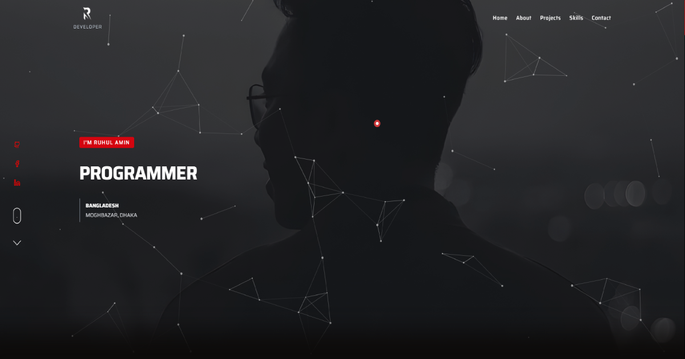

# ruhulcodes.com

<p align="center">
  <a href="https://www.ruhulcodes.com"></a>
</p>

Source of my portfolio: case studies for seventeen products, interactive architecture diagrams, two engineering write-ups, and a resume and CV rendered as real A4 pages with PDF download. Fully static; the only server code is the contact form.

Next.js 15 (App Router) · React 19 · TypeScript · Tailwind CSS 4 · Motion

## What is in it

- **Work**: 17 case studies driven by one content file (`src/content/projects.ts`). Confidential projects are described through the engineering and an SVG architecture diagram instead of screenshots.
- **Systems**: interactive diagrams (`src/content/systems.ts`) where every node opens the real design decision and a code excerpt. Layout is computed from label widths, not hard-coded.
- **Writing**: articles built from the actual code they describe (integer money, tenant isolation at the ORM).
- **Resume and CV**: `/resume` (one A4 page) and `/cv` (two pages) rendered as paper sheets with a responsive scaler; `@page` print CSS produces the PDFs in `public/`.
- **About and contact**: timeline, education, one real client testimonial, a contact form that emails me (the only API route).
- Hand-written canvas constellation in the hero, CSS-driven reveals that survive server rendering, a `<noscript>` fallback, and no client-side state library.

## Structure

```
src/
  app/(home)/        routes: work, work/[slug], systems, services, process, writing, about, resume, cv, contact
  app/api/contact    the one server route (zod validation + email)
  components/site    Hero, ProjectCard, SystemDiagram, Documents (resume/CV), Paper (A4 scaler), NetworkCanvas
  components/motion  Reveal, Words, Stagger, Tilt, Magnetic, Counter
  content/           projects, systems, writing, documents, site   (all copy lives here)
public/work/         case-study images and SVG diagrams
public/*.pdf         generated resume and CV
```

## Run it

```bash
npm install
npm run dev        # http://localhost:3000
npm run build      # static build + sitemap
npm run lint
```

The contact form needs `EMAIL_USER`, `EMAIL_PASS` and `ADMIN_EMAIL`; everything else works without environment variables.

## Regenerating the PDFs

Run the production build, start it on a port, and print the two pages with headless Chrome:

```bash
npm run build && npx next start -p 3011
"/Applications/Google Chrome.app/Contents/MacOS/Google Chrome" --headless=new --no-pdf-header-footer \
  --print-to-pdf=public/Ruhul-Amin-Resume.pdf http://localhost:3011/resume
"/Applications/Google Chrome.app/Contents/MacOS/Google Chrome" --headless=new --no-pdf-header-footer \
  --print-to-pdf=public/Ruhul-Amin-CV.pdf http://localhost:3011/cv
```

## Deployment

Vercel, from `master`. CI runs lint, type-check and build on every push.

## License

MIT for the code. The content (case studies, writing, images, resume) is mine and not licensed for reuse.
