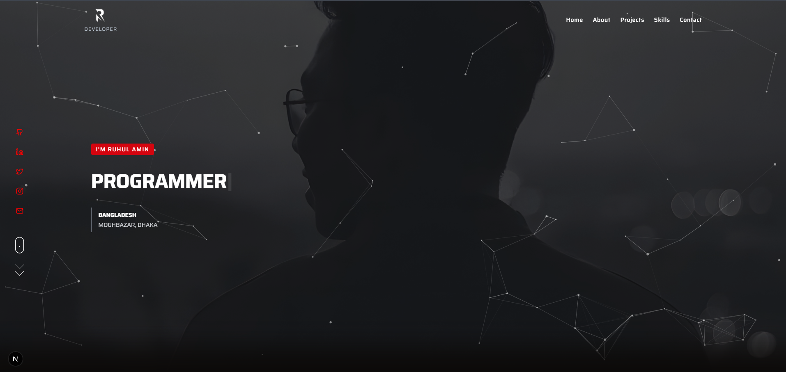

# Personal Portfolio Website



## 🚀 Overview

A modern, responsive portfolio website built with Next.js 15, featuring smooth animations, interactive elements, and a clean design. This portfolio showcases my projects, skills, and professional experience in an engaging way.

## ✨ Features

- **Modern UI/UX**: Clean, responsive design with dark/light mode(only in Dashboard) 
- **Interactive Elements**: Animations, particle effects, and smooth scrolling
- **Performance Optimized**: Fast loading and rendering
- **Fully Responsive**: Works on all devices and screen sizes
- **Contact Form**: Built-in form handling with validation
- **Authentication**: User authentication with Clerk
- **SEO Friendly**: Optimized for search engines

## 🛠️ Technologies Used

- **Framework**: [Next.js 15](https://nextjs.org/)
- **Styling**: [Tailwind CSS](https://tailwindcss.com/)
- **UI Components**: [Radix UI](https://www.radix-ui.com/)
- **Authentication**: [Clerk](https://clerk.dev/)
- **Animations**: 
  - [Framer Motion](https://www.framer.com/motion/)
  - [Lenis](https://lenis.studiofreight.com/)
  - [React Scroll Parallax](https://www.npmjs.com/package/react-scroll-parallax)
  - [tsParticles](https://particles.js.org/)
- **Form Handling**: [React Hook Form](https://react-hook-form.com/) with [Zod](https://zod.dev/) validation
- **State Management**: [Zustand](https://zustand-demo.pmnd.rs/)
- **Icons**: [Lucide React](https://lucide.dev/) and [React Icons](https://react-icons.github.io/react-icons/)
- **Notifications**: [Sonner](https://sonner.emilkowal.ski/)
- **Effects**: 
  - [TypeWriter Effect](https://www.npmjs.com/package/typewriter-effect)
  - [CountUp](https://www.npmjs.com/package/react-countup)
  - [DotLottie Player](https://dotlottie.io/)
  - [Animated Cursor](https://www.npmjs.com/package/react-animated-cursor)

## 📋 Prerequisites

- Node.js 18.x or later
- npm or yarn or pnpm

## 🚀 Getting Started

1. **Clone the repository**

```bash
git clone https://github.com/CodeBuddy07/portfolio-client-site-next-js.git
cd portfolio-client-site-next-js
```

2. **Install dependencies**

```bash
npm install
# or
yarn install
# or
pnpm install
```

3. **Environment Setup**

Create a `.env.local` file in the root directory and add your environment variables:

```
NEXT_PUBLIC_CLERK_PUBLISHABLE_KEY=your_clerk_publishable_key
CLERK_SECRET_KEY=your_clerk_secret_key
# Add any other environment variables here
```

4. **Run the development server**

```bash
npm run dev
# or
yarn dev
# or
pnpm dev
```

5. **Open your browser**

Navigate to [http://localhost:3000](http://localhost:3000) to see your portfolio website.


## 📱 Responsive Design

The portfolio is fully responsive and works well on:
- Mobile devices
- Tablets
- Laptops/Desktops
- Large screens

## 🔒 Authentication

This project uses Clerk for authentication. To customize the authentication flow:

1. Create an account on [Clerk](https://clerk.dev/)
2. Set up your application and get your API keys
3. Update the `.env` file with your keys

## 🚀 Deployment

### Deploy to Vercel

The easiest way to deploy your Next.js app is to use the [Vercel Platform](https://vercel.com).

```bash
npm install -g vercel
vercel
```

### Deploy to Netlify

You can also deploy to [Netlify](https://netlify.com):

1. Push your code to GitHub
2. Sign up for Netlify
3. Create a new site from Git
4. Select your repository
5. Configure build settings:
   - Build command: `npm run build`
   - Publish directory: `.next`

## 🧩 Future Improvements

- [ ] Add blog functionality
- [ ] Implement i18n for multiple languages
- [ ] Add analytics
- [ ] Improve accessibility
- [ ] Add more interactive elements
- [ ] Create a CMS integration

## 📄 License

This project is licensed under the MIT License - see the [LICENSE](LICENSE) file for details.

## 📞 Contact

- Website: [your-website.com](https://your-website.com)
- Email: rjruhul05@gmail.com
- LinkedIn: [linkedin.com/in/ruhul-amin-b39a69249](https://www.linkedin.com/in/ruhul-amin-b39a69249/)
- GitHub: [github.com/CodeBuddy07](https://github.com/CodeBuddy07)

---

⭐️ If you found this project helpful, please consider giving it a star on GitHub! ⭐️